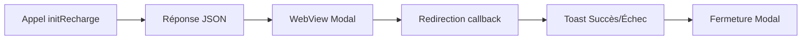

# 📱 Intégration Mobile Android

Cette documentation décrit l'implémentation de l'application mobile Android (Jetpack Compose) pour le flux de paiement via CinetPay.

## 📂 Structure du projet Android

- **`ApiService.kt`** (`app/src/main/java/com/suzosky/coursier/network/ApiService.kt`)
  - Utilise OkHttp3 pour les requêtes HTTP non sécurisées (certificats ignorés en dev).
  - Méthode clé : `initRecharge(coursierId: Int, montant: Double, callback: (String?, String?) -> Unit)`
    - Appelle `api/init_recharge.php` avec `coursier_id` et `montant`, et parse le JSON de réponse via `JSONObject`.
    - Renvoie `payment_url` en cas de succès, ou `error` en cas d'échec.
    - Parse la réponse JSON : `{ "success":true, "payment_url":"..." }`.

- **`CoursierScreen.kt`** (`app/src/main/java/com/suzosky/coursier/ui/screens/CoursierScreen.kt`)
  - Affiche l'écran principal du livreur en Compose.
  - Bouton **Recharger** déclenche `ApiService.initRecharge`.
  - Ouvre une **WebView** dans un `Dialog` Compose pour afficher la page de paiement.
  - Intercepte les redirections vers `api/cinetpay_callback.php` via `WebViewClient.shouldOverrideUrlLoading`.
  - Affiche un `Toast` de confirmation (succès / échec) et ferme le modal.

## 🔄 Flux de Paiement



1. L'utilisateur clique sur **Recharger**.
2. `ApiService.initRecharge(1, montant)` envoie une requête POST.
3. Serveur répond avec `success: true` et `payment_url`.
4. L'app ouvre un `Dialog` contenant une WebView pointant vers `payment_url`.
5. Lorsque la WebView charge une URL contenant `api/cinetpay_callback.php`, on extrait le paramètre `status`.
6. On affiche un `Toast` (`"Recharge réussie"` ou `"Recharge échouée"`) et on ferme le modal.

## ⚙️ Configuration Android

- **Permissions** dans `AndroidManifest.xml` :
  ```xml
  <uses-permission android:name="android.permission.INTERNET" />
  <application
      android:usesCleartextTraffic="true"
      ...>
  ```

- **Accès `localhost`** depuis l'émulateur :
  - `127.0.0.1`/`localhost` dans WebView est mappé vers l'hôte de l'appareil.
  - Utiliser `10.0.2.2` pour atteindre le serveur web local XAMPP.

- **Debug** :
  - Vérifier les logs `Log.d("ApiService", ...)` et `Log.e("ApiService", ...)`.
  - Ajouter `android:debuggable="true"` dans `<application>` si nécessaire.

---
*Ajouté : Septembre 2025*