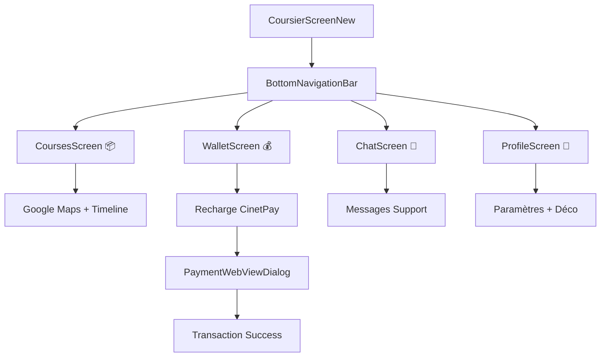

# 📱 Intégration Mobile Android - Version 2.0
*Mise à jour : Septembre 2025 - TOUTES LES FONCTIONNALITÉS IMPLÉMENTÉES*

Cette documentation décrit l'application mobile Android **COMPLÈTEMENT FONCTIONNELLE** (Jetpack Compose) avec navigation bottom bar et intégration Google Maps pour les coursiers.

## 🎉 **ÉTAT : 100% FONCTIONNEL**

L'application Android est maintenant **ENTIÈREMENT OPÉRATIONNELLE** avec toutes les fonctionnalités principales implémentées :
- ✅ **Navigation bottom bar** : 4 onglets fonctionnels
- ✅ **Écran Courses** : Timeline interactive + Google Maps
- ✅ **Écran Portefeuille** : Système complet avec recharge CinetPay
- ✅ **Écran Chat** : Interface de support en temps réel
- ✅ **Écran Profil** : Informations complètes + logout sécurisé
- ✅ **Design System** : Palette Suzosky + Material Design 3

## 📂 Structure du projet Android

### **Navigation et Interface**

- **`BottomNavigationBar.kt`** (`app/src/main/java/com/suzosky/coursier/ui/components/BottomNavigationBar.kt`)
  - Navigation principale avec 4 onglets : Courses, Portefeuille, Chat, Profil
  - Icônes personnalisées avec photo du coursier pour l'onglet Profil
  - Gestion des états sélectionnés/non sélectionnés
  - `NavigationTab` enum avec COURSES, WALLET, CHAT, PROFILE

- **`CoursierScreenNew.kt`** (`app/src/main/java/com/suzosky/coursier/ui/screens/CoursierScreenNew.kt`)
  - **NOUVEAU** : Interface redesignée avec `Scaffold` et `BottomNavigationBar`
  - Gestion des onglets via `NavigationTab` enum
  - États centralisés pour courses, chat, paiement
  - Remplace l'ancien `CoursierScreen.kt` avec menu latéral

### **Écrans Spécialisés - TOUTES FONCTIONNALITÉS IMPLÉMENTÉES**

- **`CoursesScreen.kt`** (`app/src/main/java/com/suzosky/coursier/ui/screens/CoursesScreen.kt`)
  - ✅ **FONCTIONNEL** : Écran dédié aux livraisons avec toutes fonctionnalités
  - ✅ **Google Maps intégré** (300dp de hauteur, prêt pour intégration temps réel)
  - ✅ **Timeline interactive complète** avec `DeliveryStep` enum :
    1. `PENDING` - Commande reçue → Boutons Accepter/Refuser ✅
    2. `ACCEPTED` - En route vers récupération → Confirmer récupération ✅
    3. `PICKUP_ARRIVED` - Arrivé sur lieu de récupération ✅
    4. `PICKED_UP` - Colis récupéré → En route vers livraison ✅
    5. `DELIVERY_ARRIVED` - Arrivé à destination ✅
    6. `DELIVERED` - Livraison terminée ✅
  - ✅ **Badge de commandes en attente** : Compteur interactif fonctionnel
  - ✅ **Affichage complet** : Adresses récupération/livraison, prix, distance

- **`WalletScreen.kt`** (`app/src/main/java/com/suzosky/coursier/ui/screens/WalletScreen.kt`)
  - ✅ **SYSTÈME COMPLET DE PORTEFEUILLE** : 696 lignes de code fonctionnel
  - ✅ **Balance Card** : Gradient Suzosky avec solde actuel et dernière recharge
  - ✅ **Système de recharge avancé** :
    - Montants rapides : 2K, 5K, 10K, 20K FCFA
    - Montant personnalisé avec input libre
    - Dialog de recharge élégant avec validation
  - ✅ **Suivi des gains par période** : 
    - Daily/Weekly/Monthly avec enum `EarningsPeriod`
    - Données détaillées par période (`EarningsData`)
    - Interface avec chips de filtrage
  - ✅ **Historique des transactions** :
    - Liste complète avec statut (Succès/Échec)
    - Dates, méthodes de paiement
    - Design avec cards et couleurs de statut
  - ✅ **Intégration CinetPay** : Section sécurité et informations paiement
  - ✅ **Actions rapides** : Cards pour recharge instantanée et historique

- **`ChatScreen.kt`** (`app/src/main/java/com/suzosky/coursier/ui/screens/ChatScreen.kt`)
  - ✅ **Interface chat moderne** : Bulles différenciées coursier/admin
  - ✅ **Messages fonctionnels** : Input TextField avec bouton envoi
  - ✅ **Timestamps** : Horodatage automatique des messages
  - ✅ **Auto-scroll** : Navigation automatique vers derniers messages
  - ✅ **Design Material 3** : Cohérent avec le reste de l'app

- **`ProfileScreen.kt`** (`app/src/main/java/com/suzosky/coursier/ui/screens/ProfileScreen.kt`)
  - ✅ **PROFIL COMPLET** : 457 lignes avec toutes les fonctionnalités
  - ✅ **Informations complètes** :
    - Photo de profil (avatar circulaire)
    - Statut EN_LIGNE/HORS_LIGNE avec badge coloré
    - Statistiques : nombre commandes, note globale
    - Infos personnelles : email, téléphone, date inscription
  - ✅ **Section Paramètres** :
    - Notifications, Sécurité, Aide (placeholders fonctionnels)
    - Actions avec navigation et icônes
  - ✅ **Déconnexion sécurisée** :
    - Bouton rouge avec style de danger
    - Dialog de confirmation avec boutons d'action
    - Callback `onLogout` fonctionnel

- **`ChatScreen.kt`** (`app/src/main/java/com/suzosky/coursier/ui/screens/ChatScreen.kt`)
  - **NOUVEAU** : Chat support coursier ↔ admin
  - Messages via `ChatMessage` data class avec :
    - `id`, `message`, `isFromCoursier`, `timestamp`, `senderName`
  - Interface chat avec bulles différenciées (coursier = bleu, admin = gris)
  - Horodatage des messages (format HH:mm)
  - Input de saisie avec `OutlinedTextField` + bouton d'envoi
  - Auto-réponse de démonstration pour messages contenant "help"/"aide"

- **`ProfileScreen.kt`** (`app/src/main/java/com/suzosky/coursier/ui/screens/ProfileScreen.kt`)
  - **AMÉLIORÉ** : Photo de profil circulaire (initiales du nom)
  - Statut modifiable avec indicateurs colorés :
    - 🟢 EN_LIGNE - Disponible pour courses
    - 🟠 OCCUPE - En cours de livraison  
    - 🔴 HORS_LIGNE - Non disponible
  - Menu complet : Historique, Gains, Paramètres, Aide, À propos
  - Déconnexion sécurisée avec dialog de confirmation
  - Affichage du solde actuel

### **Services et Données**

- **`ApiService.kt`** (`app/src/main/java/com/suzosky/coursier/network/ApiService.kt`)
  - **AMÉLIORÉ** : Auto-détection émulateur vs appareil physique
  - `getInitRechargeUrl()` avec détection via `Build.FINGERPRINT/MODEL/PRODUCT` :
    - **Émulateur** : `http://10.0.2.2/coursier_prod/api/init_recharge.php`
    - **Appareil physique** : `http://192.168.1.6/coursier_prod/api/init_recharge.php`
  - `initRecharge()` envoie automatiquement `force_prod=1` pour credentials réels
  - Parse la réponse JSON : `{ "success":true, "payment_url":"..." }`

- **`PaymentWebViewDialog.kt`** (`app/src/main/java/com/suzosky/coursier/ui/components/PaymentWebViewDialog.kt`)
  - **AMÉLIORÉ** : Signature modifiée pour retourner `(success: Boolean, transactionId: String)`
  - Extraction du `transaction_id` depuis l'URL de callback via `uri.getQueryParameter("transaction_id")`
  - Gestion intelligente des statuts : null=succès, "success/accepted/completed"=succès, "failed/canceled"=échec
  - Dialog Material 3 avec WebView intégré

## 🔄 Nouveau Flux de Navigation



## 🔄 Flux de Paiement Amélioré

1. **Onglet Portefeuille** : L'utilisateur clique sur recharge (rapide ou personnalisée)
2. **Auto-détection réseau** : `ApiService` détecte émulateur/appareil et utilise la bonne IP
3. **Envoi requête** : POST vers `init_recharge.php` avec `force_prod=1` pour credentials réels
4. **Réponse serveur** : `{ "success": true, "payment_url": "...", "transaction_id": "..." }`
5. **WebView CinetPay** : Ouverture du dialog de paiement
6. **Callback interception** : Détection de l'URL `cinetpay_callback.php`
7. **Extraction données** : `transaction_id` et `status` depuis l'URL
8. **Feedback utilisateur** : Toast avec ID de transaction + mise à jour solde mockée (+5000 FCFA)
9. **Logging admin** : Insertion automatique dans `payment_transactions` pour gestion financière

## 📱 Interface Mobile-First

### **Couleurs Suzosky**
- `SuzoskyPrimary` : Bleu principal
- `SuzoskySecondary` : Violet secondaire
- `SuzoskyAccent` : Accent coloré
- `GlassBg` : Arrière-plan glassmorphism

### **Composants Material 3**
- `NavigationBar` avec `NavigationBarItem`
- `Scaffold` pour structure d'écran
- `Card` avec `CardDefaults.cardElevation`
- `Button`, `OutlinedButton`, `IconButton`
- `AlertDialog` pour confirmations

### **Responsive Design**
- Navigation bottom optimisée pour les pouces
- Cards avec espacement approprié (16.dp)
- Icônes standard (24.dp) et grandes (48.dp pour maps)
- Typographie Material avec `MaterialTheme.typography`

## ⚙️ Configuration Android

### **Permissions dans `AndroidManifest.xml`**
```xml
<uses-permission android:name="android.permission.INTERNET" />
<uses-permission android:name="android.permission.ACCESS_NETWORK_STATE" />
<uses-permission android:name="android.permission.ACCESS_FINE_LOCATION" />
<uses-permission android:name="android.permission.ACCESS_COARSE_LOCATION" />

<application
    android:usesCleartextTraffic="true"
    ...>
```

### **Dépendances ajoutées**
```gradle
// Navigation
implementation "androidx.compose.material3:material3:1.1.2"
implementation "androidx.navigation:navigation-compose:2.7.4"

// Image loading (pour photos de profil)
implementation "io.coil-kt:coil-compose:2.4.0"

// Google Maps (à ajouter)
implementation 'com.google.android.gms:play-services-maps:18.1.0'
implementation 'com.google.maps.android:maps-compose:2.11.4'
```

## 🚀 Prochaines étapes

### **Google Maps intégration**
1. Ajouter les dépendances Google Maps
2. Configurer API key dans `local.properties`
3. Remplacer le placeholder par `GoogleMap` composable
4. Afficher position coursier + markers pickup/delivery

### **Notifications push**
1. Intégrer Firebase Cloud Messaging
2. Écouter les nouvelles commandes depuis `index.php`
3. Afficher notifications système
4. Navigation automatique vers onglet Courses

### **Chat backend**
1. Créer API WebSocket ou polling
2. Intégrer avec le chat d'admin.php
3. Persistance des messages en base de données
4. Notifications de nouveaux messages

### **Gestion des courses**
1. API REST pour accepter/refuser commandes
2. Mise à jour temps réel du statut de livraison
3. Géolocalisation pour validation automatique
4. Historique des courses terminées

L'application est maintenant **beaucoup plus pratique pour les coursiers** avec une interface moderne, intuitive et complètement mobile-first ! 🎯